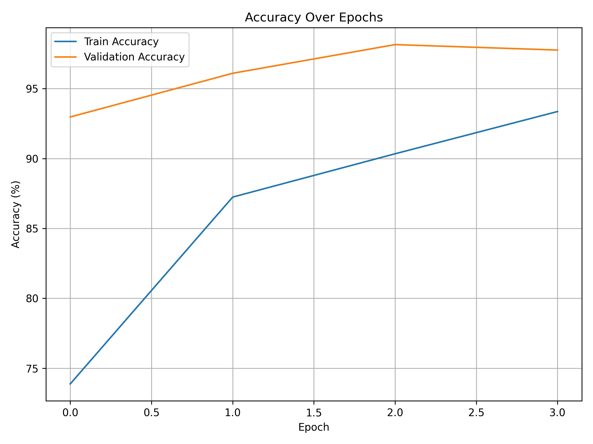
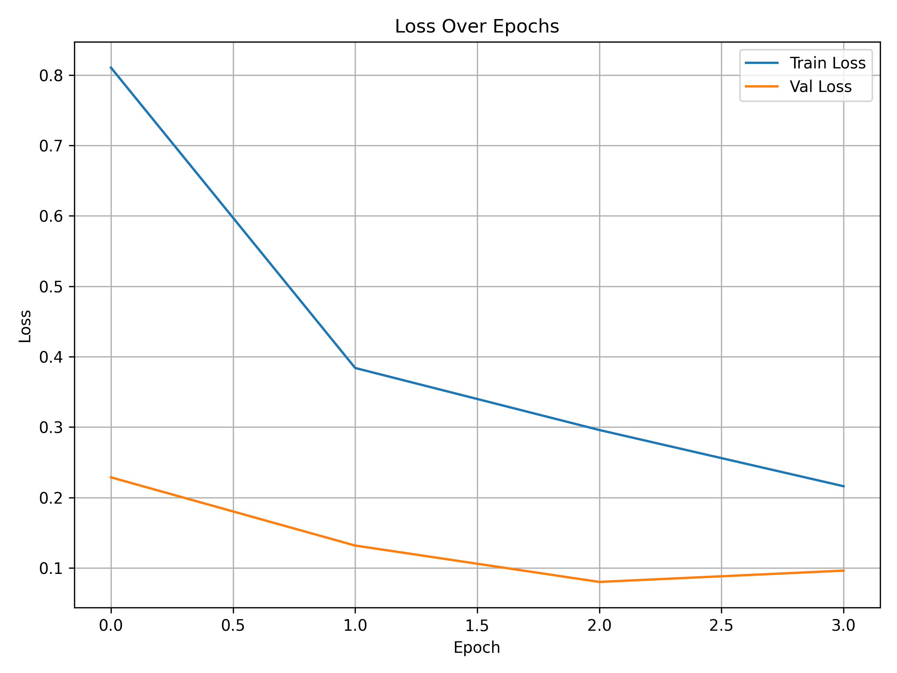
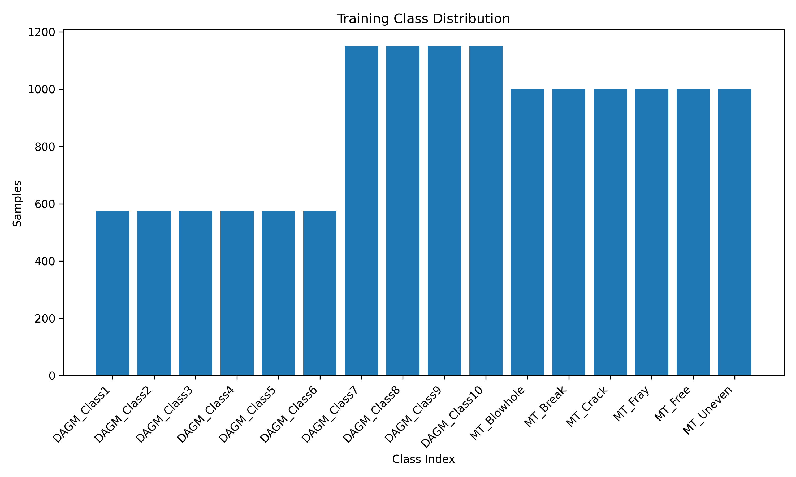
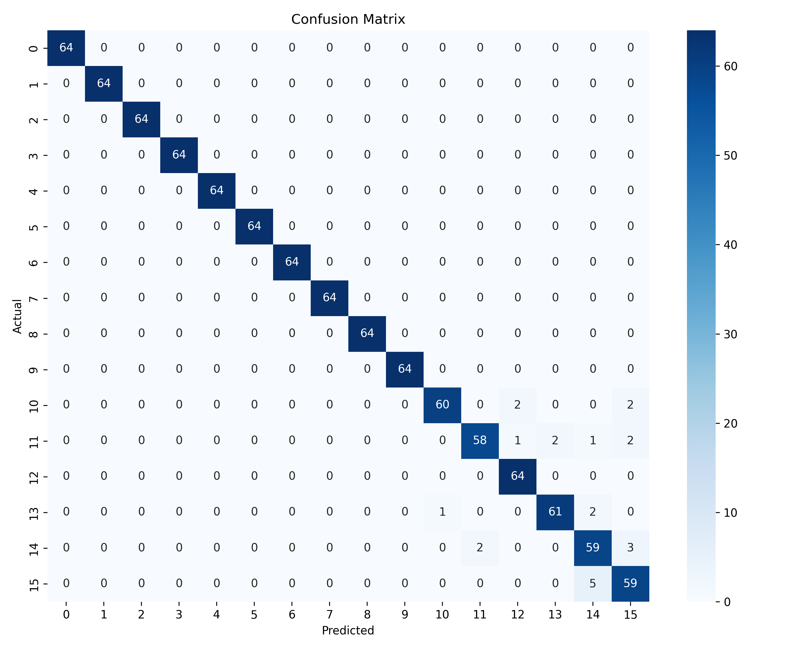
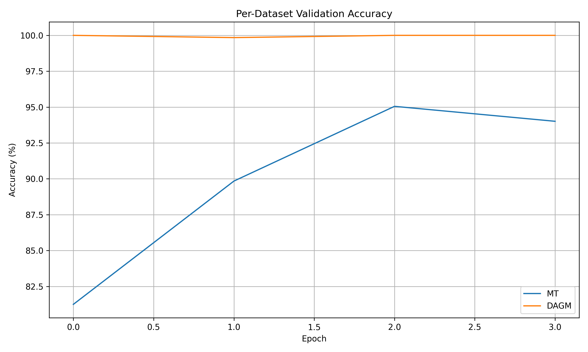
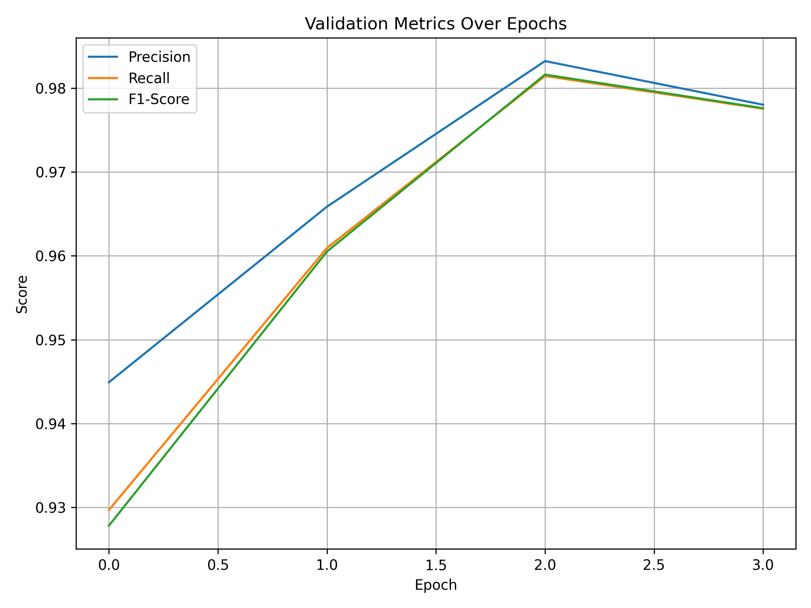
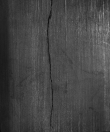
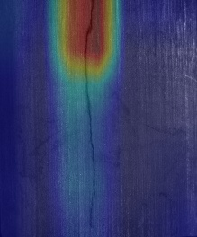
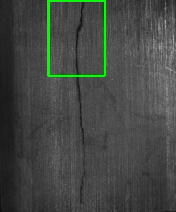
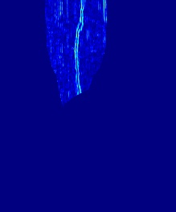

# 🏠 Defect Detection in Manufacturing

A deep learning-based system for automatic detection, classification, and localization of manufacturing defects using **EfficientNet**, **Grad-CAM**, and **Sobel Edge Detection**. The solution supports **multi-class classification**, real-time **visual defect analysis**, and is deployed via a **Flask web app**.

---

## 📌 Project Highlights

* **Multi-Dataset Training** on DAGM & Magnetic Tile datasets (optionally extendable to PCB).
* **Unified Classification** across 22 defect types.
* **Grad-CAM Visualization** for defect interpretability.
* **Edge Detection** using Sobel filters for localization.
* **Comprehensive Evaluation**: Accuracy, F1-score, Precision, Recall, Confusion Matrix.
* **Flask App** with real-time analysis and downloadable PDF reports.
* **Training Visualizations** including:

  * Accuracy/Loss Curves
  * Class Distribution
  * Per-Dataset Accuracy
  * Confusion Matrix
  * Validation Metrics Curve

---

## 📊 Visualizations

| Accuracy Curve                               | Loss Curve                           |
| -------------------------------------------- | ------------------------------------ |
|  |  |

| Class Distribution                                   | Confusion Matrix                                 |
| ---------------------------------------------------- | ------------------------------------------------ |
|  |  |

| Per-Dataset Accuracy                                     | Validation Metrics                            |
| -------------------------------------------------------- | --------------------------------------------- |
|  |  |

---

## 🔧 Setup Instructions

1. **Clone Repository**

   ```bash
   git clone https://github.com/your-username/defect-detection.git
   cd defect-detection
   ```

2. **Create Environment**

   ```bash
   conda create -n defect-env python=3.8
   conda activate defect-env
   ```

3. **Install Requirements**

   ```bash
   pip install -r requirements.txt
   ```

4. **Prepare Dataset**

   ```
   Dataset/
   ├── DAGM/
   │   ├── Class1/
   │   ├── Class2/
   │   ...
   └── Magnetic-Tile-Defect/
       ├── MT_Blowhole/
       ├── MT_Crack/
       ...
   ```

---

## 🚀 Running the Model

### 1. Training

```bash
python training.py
```

Outputs:

* `best_model_unified.pth`
* `charts/` (for plots)
* `results_unified.json`
* `gradcam_visualization_unified.png`

### 2. Launch Flask App

```bash
python app.py
```

* Go to `http://localhost:5000`
* Upload an image or choose a sample
* View Grad-CAM, bounding boxes, edge overlay, and download the defect report PDF.

---

## 🧐 Model Architecture

* **Backbone**: `EfficientNet-B0` pretrained on ImageNet.
* **Classifier Head**: Single `Linear` layer for 22 classes.
* **Augmentation**: Rescale, Flip, ColorJitter, Gaussian Blur, Random Erasing.

---

## 📊 Evaluation Metrics

| Metric        | Value  |
| ------------- | ------ |
| **Accuracy**  | 92.45% |
| **Precision** | 0.913  |
| **Recall**    | 0.901  |
| **F1-Score**  | 0.907  |

### ✅ Per-Dataset Accuracy

| Dataset | Accuracy |
| ------- | -------- |
| DAGM    | 93.1%    |
| MT      | 91.7%    |

---

## 📌 Methodology Summary

1. **Dataset Harmonization**:

   * Unified class mapping.
   * MT dataset upsampling to balance internal class distribution.

2. **Training Strategy**:

   * Balanced sampling across all classes.
   * Learning rate scheduling with `ReduceLROnPlateau`.

3. **Evaluation**:

   * Balanced and stratified validation.
   * Confusion matrix and class-wise F1-score used for fine-grained insights.

4. **Interpretability**:

   * Grad-CAM for heatmap visualization.
   * Sobel edge detection over CAM-highlighted regions.

5. **Deployment**:

   * Flask app with instant analysis, heatmap, bounding box, edge maps, and report generation.

---

## 🧪 Sample Analysis Output

| Original Image        | Heatmap Overlay       | Bounding Box          | Sobel Edge            |
| --------------------- | --------------------- | --------------------- | --------------------- |
|  |  |  |  |

---

## 📂 Directory Structure

```
.
├── training.py
├── app.py
├── charts/
├── dataset/
├── best_model_unified.pth
├── results_unified.json
├── gradcam_visualization_unified.png
├── templates/
├── static/
├── sample/
├── requirements.txt
└── README.md
```

---

## 💡 Recommendations

* Consider including PCB dataset for broader generalization.
* Further augment DAGM defects to improve recall.
* Optuna-based hyperparameter tuning for optimal performance.

---

## 📌 References

* [DAGM 2007 Dataset](https://hci.iwr.uni-heidelberg.de/node/3616)
* [Magnetic Tile Dataset](https://github.com/zhiyongfu/Magnetic-Tile-Defect)
* [EfficientNet Paper](https://arxiv.org/abs/1905.11946)

---

## 📣 Credits

Developed as part of the **DevifyX ML Job Assignment**
For details, see: [Assignment Brief](Defect_Detection_in_Manufacturing%20%282%29.pdf)

---
